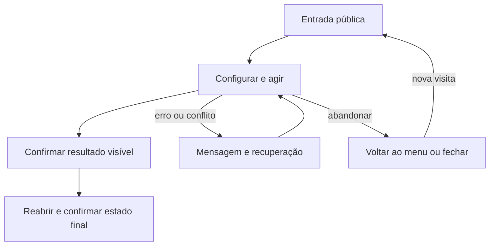

# Ajustar e reabrir os valores realmente salvos



```yaml
journey:
  id: J-balanceamento-salvo
  name: Ajustar e reabrir os valores realmente salvos
  value_statement: Nova leitura mostra o valor salvo e outra aba não sobrescreve sem conflito
  personas: [Edney]
  entry_points: [http://127.0.0.1:4174/game-design.html]
  actions: [Painel → edição → salvar → reabrir → próxima partida]
  goal: {observable: "Nova leitura mostra o valor salvo e outra aba não sobrescreve sem conflito"}
  true_end_state: Nova leitura mostra o valor salvo e outra aba não sobrescreve sem conflito
  abandonment: [Fechar ou voltar sem confirmação; nova visita respeita persistência documentada]
  crosses: [UI, motor, JSON local]
```
