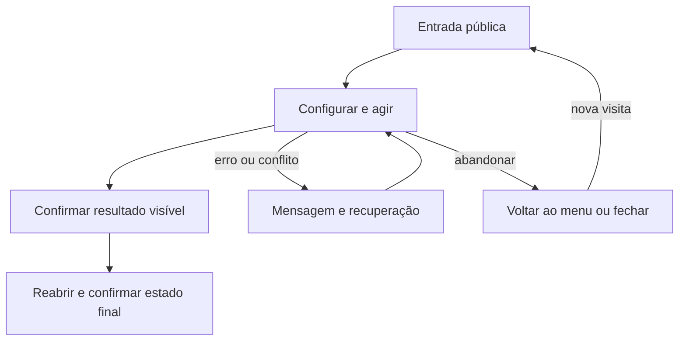

# Jogar até o resultado e iniciar revanche



```yaml
journey:
  id: J-partida-completa
  name: Jogar até o resultado e iniciar revanche
  value_statement: Resultado com quatro participantes e revanche limpa preservando escolhas
  personas: [Lia]
  entry_points: [http://127.0.0.1:4174/]
  actions: [Menu → seleção → movimento e conversão → resultado → revanche]
  goal: {observable: "Resultado com quatro participantes e revanche limpa preservando escolhas"}
  true_end_state: Resultado com quatro participantes e revanche limpa preservando escolhas
  abandonment: [Fechar ou voltar sem confirmação; nova visita reinicia partida e preferências; apenas game-design.json salvo permanece no disco]
  crosses: [UI, motor, JSON local]
```
