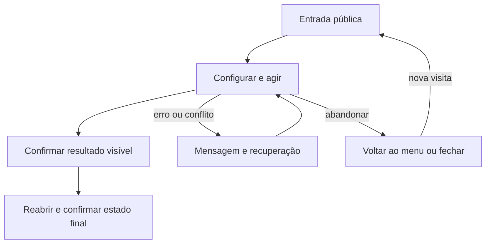

# Pausar e retomar com preferências por teclado



```yaml
journey:
  id: J-preferencias-teclado
  name: Pausar e retomar com preferências por teclado
  value_statement: Pausa preserva tempo e controles voltam com foco visível
  personas: [Rui]
  entry_points: [http://127.0.0.1:4174/]
  actions: [Menu → preferências → partida → pausa → preferências → continuar]
  goal: {observable: "Pausa preserva tempo e controles voltam com foco visível"}
  true_end_state: Pausa preserva tempo e controles voltam com foco visível
  abandonment: [Fechar ou voltar sem confirmação; nova visita respeita persistência documentada]
  crosses: [UI, motor, JSON local]
```
